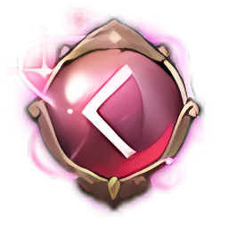
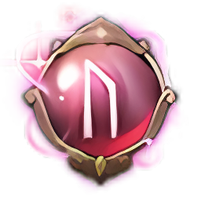
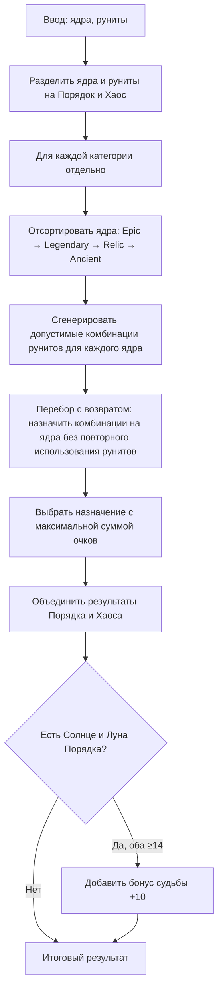

# Калькулятор Созвездия А.Р.К.

Веб-приложение для расчёта и оптимизации назначения рунитов на ядра Созвездия А.Р.К. в игре Lost Ark.

## Назначение

Калькулятор помогает игрокам:
- конфигурировать до 6 ядер с выбором типа и редкости;
- добавлять руниты с указанием очков порядка и очков хаоса;
- оптимально распределять руниты по ядрам с учётом эффекта ядра и бонусов судьбы;
- хранить данные нескольких персонажей в браузере.

## Функционал

### Ядра (Cores)

Ядра бывают двух категорий — **Порядок** и **Хаос**, каждый тип имеет три вариации (Солнце, Луна, Звезда).


Поддерживаемые редкости: Эпичский, Легендарный, Реликвия, Древний. У каждого ядра — до 4 слотов для рунитов.

### Руниты

Руниты делятся на категории **Порядок** и **Хаос**. В каждое ядро можно помещать только руниты соответствующей категории.

**Порядок:**
- Закон
- Истина
- Обет





**Хаос:**
- Крах
- Раздор
- Ропот


Для каждого рунита задаются **очки порядка** и **очки хаоса** — алгоритм подбирает оптимальное распределение по эффекту ядра.

### Перетаскивание

Руниты можно перетаскивать между пулом и карточками ядер. Совместимые ядра подсвечиваются при перетаскивании.

### Оптимизация

По нажатию «Рассчитать» приложение подбирает лучшее назначение рунитов по ядрам с учётом:
- эффекта ядра по порогам очков (10, 14, 17, 18, 19, 20);
- бонуса судьбы за связки Солнце–Луна;
- редкости ядер.

## Алгоритм расчёта

### Входные данные

- **Ядра** — до 6 штук, у каждого: тип (Порядок/Хаос, Солнце/Луна/Звезда), редкость (Эпичский, Легендарный, Реликвия, Древний).
- **Руниты** — для каждого: категория (Порядок/Хаос), очки порядка, очки хаоса.

### Ограничения

- В ядро можно поместить только руниты своей категории (Порядок → ядра Порядка, Хаос → ядра Хаоса).
- Максимум 4 рунита на ядро.
- Ограничение по ёмкости ядра (макс. сумма очков хаоса в слоте): Epic 9, Legendary 12, Relic 15, Ancient 17.

### Формула эффекта ядра

**Шаг 1.** Складываем очки порядка всех рунитов в ядре — получаем **P** (суммарные очки ядра).

**Шаг 2.** У каждого ядра есть список порогов по редкости. Порог считается *достигнутым*, если суммарные очки P не меньше этого порога.

Например: если P = 15, то пороги 10 и 14 достигнуты; порог 17 — нет.

**Шаг 3.** За каждый достигнутый порог добавляем в счёт ядра его вес:

| Порог | Вес |
|-------|-----|
| 10 | 1 |
| 14 | 5 |
| 17 | 5 |
| 18 | 0.5 |
| 19 | 0.5 |
| 20 | 0.5 |

**Шаг 4.** Для ядра Древний при достижении порога 17 добавляется бонус +1.5.

**Пороги по редкости:**
- Эпичский: только 10
- Легендарный: 10 и 14
- Реликвия, Древний: 10, 14, 17, 18, 19, 20

**Формула очков ядра:**

$$S = \sum_{p \in B,\; P \geq p} w(p) + \text{бонус Ancient 17}$$

где B — список порогов для редкости ядра, P — сумма очков порядка рунитов в ядре, w(p) — вес порога из таблицы выше.

### Бонус судьбы

Дополнительно **+10** к общему счёту, если одновременно:
- есть ядро Солнца Порядка;
- есть ядро Луны Порядка;
- в обоих сумма очков порядка ≥ 14.

### Итоговая цель

Максимизировать сумму очков всех ядер плюс бонус судьбы (если выполняется условие выше):

$$\text{Итог} = \sum_{\text{все ядра}} S_{\text{ядро}} + \text{Бонус судьбы}$$

### Блок-схема алгоритма

> Схема в формате Mermaid — отображается на GitHub. В локальном просмотре Markdown (например, VS Code) диаграмма может не рендериться; используйте предпросмотр на GitHub или расширение «Markdown Preview Mermaid Support».



### Краткое описание шагов

1. **Разделение** — ядра Порядка обрабатываются только с рунитами Порядка, ядра Хаоса — с рунитами Хаоса.
2. **Генерация комбинаций** — для каждого ядра перебираются все допустимые наборы рунитов (до 4 штук, с учётом лимита ёмкости).
3. **Поиск** — перебор с возвратом находит назначение рунитов по ядрам без пересечений, максимизирующее сумму очков.
4. **Бонус** — при наличии связки Солнце–Луна Порядка с ≥14 очков добавляется бонус судьбы.

### Персонажи

Можно вести несколько персонажей — переключать активного, добавлять и удалять. Данные сохраняются в `localStorage`.

### Поддержка проекта

Проект создан при поддержке межигрового сообщества **Bandits**.


## Запуск

```bash
npm install
npm run dev
```

Откройте [http://localhost:3000](http://localhost:3000) в браузере.

## Сборка

```bash
npm run build
npm start
```

## Технологии

- Next.js 16
- React 19
- shadcn/ui
- @dnd-kit (drag-and-drop)
- Tailwind CSS
